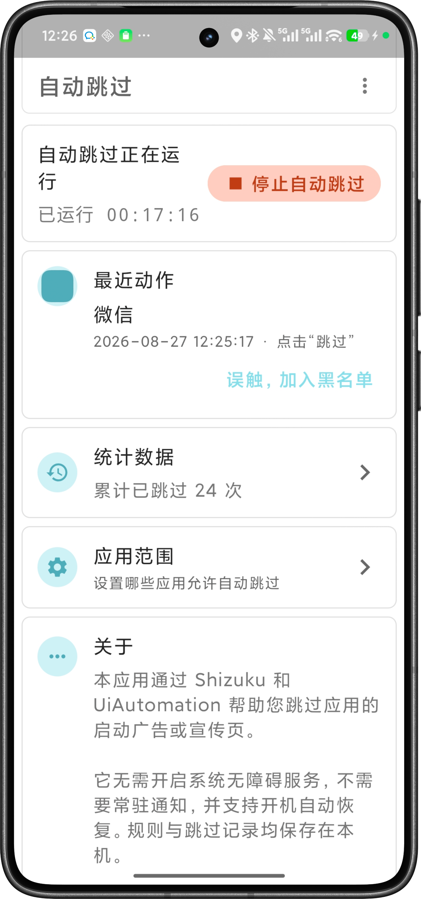

# AutoSkip（自动跳过）

AutoSkip 是一款基于 [Shizuku](https://github.com/RikkaApps/Shizuku) 和 Android `UiAutomation` 的启动广告自动跳过工具。它在广告界面出现后识别“跳过”类控件并执行点击，无需开启系统无障碍服务，也不依赖常驻通知。

[下载最新版](https://github.com/ybs15090/AutoSkip/releases) · [使用指南](doc/使用指南.md) · [点击逻辑](doc/点击与失败重试逻辑.md) · [故障排查](doc/故障排查.md) · [自行构建](doc/开发与构建.md)

> [!IMPORTANT]
> AutoSkip 是界面自动化工具，不是网络广告过滤器。它不会拦截广告请求，只能处理已经显示且能被 Android 界面系统读取的控件。网页画布、视频画面、系统安全窗口或未暴露界面元素的广告可能无法识别。

## 界面预览

<p align="center">
  
</p>

新版首页集中显示服务状态、运行时长、最近动作、累计统计和应用范围。首次启动时会显示逐项检查清单，引导完成 Shizuku 与 AutoSkip 的运行准备。

## 主要功能

- 通过 Shizuku 启动特权进程，使用 Android `UiAutomation` 监听界面并执行动作。
- 支持应用范围总开关、普通模式、严格模式、黑名单和白名单，并提供一键回顶和统一的黑名单管理页。
- 支持文字、内容描述、View ID、控件类型，以及精确、包含和正则匹配。
- 支持全局规则和应用专属规则，可配置区域、延迟与点击方式。
- 多个节点同时命中时，根据匹配质量、位置、大小和可点击性选择候选。
- 学习模式可采集当前界面候选并辅助生成专属规则。
- 节点动作无效时可查找可点击父节点，并按规则选择是否回退到坐标点击。
- 点击后重新确认候选状态，在明确仍存在时进行有次数和时间上限的重试。
- 支持误触应用快速加入黑名单、本地统计、记录管理、日志导出和开机自动恢复。

## 快速开始

需要 Android 6.0（API 23）或更高版本，以及已经安装、启动并授权的 Shizuku；Root 设备也可使用 Sui 环境。Shizuku 的具体启动方法请参阅 [Shizuku 官方使用指南](https://shizuku.rikka.app/guide/setup/)。

1. 从 [GitHub Releases](https://github.com/ybs15090/AutoSkip/releases) 下载并安装来源可信、签名一致的 APK。
2. 启动 Shizuku，并在 Shizuku 中授权 AutoSkip。
3. 返回 AutoSkip，启动自动跳过服务。
4. 进入“应用范围”；初次使用推荐开启严格模式，只允许确有启动广告的应用。
5. 使用内置规则开始测试；特殊按钮可配置专属规则或使用学习模式。

使用无线调试或电脑启动的 Shizuku，通常需要在设备重启后重新启动。AutoSkip 的“开机自动恢复”只能在 Shizuku 已满足运行条件时恢复服务，不能代替 Shizuku 自身的启动步骤。

## 文档

原 README 中的详细说明已按主题拆分到 `doc/`，根 README 保留项目介绍、快速入口和文档导航：

| 文档 | 内容 |
| --- | --- |
| [使用指南](doc/使用指南.md) | 安装、首次启动、应用范围、黑名单管理、规则配置、学习模式和记录管理 |
| [识别规则](doc/识别规则.md) | 规则字段、默认规则、候选搜索、评分、示例和误触控制 |
| [点击与失败重试逻辑](doc/点击与失败重试逻辑.md) | 事件入口、主动发现、零延迟点击、父节点/坐标回退、确认与有限重试 |
| [隐私与权限](doc/隐私与权限.md) | Android 权限、Shizuku 能力、本地数据和日志分享注意事项 |
| [故障排查](doc/故障排查.md) | 服务启动、识别失败、首次延迟、点击不生效、误触和日志采集 |
| [开发与构建](doc/开发与构建.md) | 固定工具链、本地常量、签名、构建测试、CI、Release 和真机验收 |

`doc/` 不设置第二个 `README.md`，避免同时维护两个文档首页；所有专题文档都可以返回本文件。

## 工作原理摘要

```text
窗口/内容变化事件
  → 校验前台应用与应用范围
  → 使用平台文字索引或有预算的节点树遍历查找候选
  → 根据规则和候选质量评分
  → 点击节点、可点击父节点或候选中心坐标
  → 200 ms 后复核候选是否仍存在
  → 必要时有限重试，成功后只记录一次
```

当前版本还会在新前台会话中进行最长 8 秒的轻量主动发现，以更快捕获 WebView 稍后发布的节点；零延迟候选直接在事件回调中执行，避免排在事件洪峰之后。主动发现不能提前读取尚未被 Android 暴露的节点。

日志中的点击确认 `elapsed` 从首次点击开始计算，不包含应用启动、广告加载和等待 WebView 发布节点的时间。关于本次首次点击延迟修复、时序参数、重试状态和 2026-09-04 真机验证，见[《点击与失败重试逻辑》](doc/点击与失败重试逻辑.md)。

## 构建入口

Windows 可使用：

- [一键构建.bat](一键构建.bat)：生成 Debug APK，并避免普通本地构建留下无关的 `custom.properties` 计数变化。
- [一键安装到手机.bat](一键安装到手机.bat)：检查唯一已授权设备，并用 `adb install -r` 覆盖安装已经生成的 Debug APK。

项目使用 JDK 11、Gradle 7.3.3、Android Gradle Plugin 7.2.0、Kotlin 1.5.30 和 Android SDK 30。完整准备、命令、签名和 CI 说明见[《开发与构建》](doc/开发与构建.md)。

## 下载与反馈

- 最新安装包：[GitHub Releases](https://github.com/ybs15090/AutoSkip/releases)
- 当前维护仓库：[ybs15090/AutoSkip](https://github.com/ybs15090/AutoSkip)
- 问题反馈：[GitHub Issues](https://github.com/ybs15090/AutoSkip/issues)

提交问题时，请附上手机型号、Android 版本、Shizuku/Sui 运行方式、AutoSkip 与目标应用版本、复现步骤和完整时间段日志。公开日志前请检查其中的包名、控件文字、时间和设备信息。

## 许可证与致谢

本项目采用 [Apache License 2.0](LICENSE) 开源，请在许可证允许的范围内使用、修改和分发代码。

AutoSkip 原项目由 [XJUNZ](https://github.com/xjunz) 开发，原始仓库为 [xjunz/AutoSkip](https://github.com/xjunz/AutoSkip)。当前仓库在原项目基础上继续维护和扩展，保留原作者版权信息：Copyright © XJUNZ 2021。
