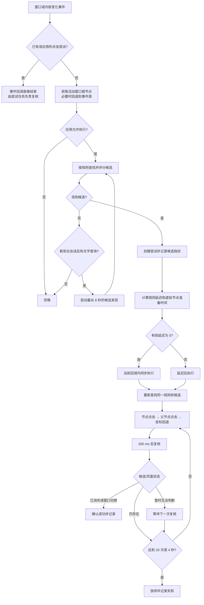

# AutoSkip 点击与失败重试逻辑

[返回项目首页](../README.md) · [使用指南](使用指南.md) · [识别规则](识别规则.md) · [故障排查](故障排查.md) · [开发与构建](开发与构建.md)

本文对应当前 `automator` 模块的实际实现，说明一次启动广告从界面事件、候选识别、点击注入到结果确认的完整链路，也解释为什么“输入事件注入成功”不等于“广告已经成功跳过”。

## 设计目标

点击链路同时解决四个问题：

1. 候选节点出现后尽快执行，避免零延迟任务继续在事件队列中等待。
2. 点击前重新确认目标仍然存在，防止延迟期间页面已经变化。
3. 兼容可点击节点、可点击父节点以及只能按坐标触发的虚拟节点。
4. 对“注入成功但应用没有响应”进行有限重试，同时避免无限连点和重复计数。

AutoSkip 只能操作 Android 已经通过 `UiAutomation` 暴露的节点。按钮已经画到屏幕上、但 WebView 尚未发布无障碍节点时，任何基于节点文字或属性的方案都无法提前确认该按钮。

## 总体流程



## 1. 事件监听与入口过滤

特权服务通过 Shizuku 创建 `UiAutomation`，监听以下事件：

- `TYPE_WINDOWS_CHANGED`
- `TYPE_WINDOW_STATE_CHANGED`
- `TYPE_WINDOW_CONTENT_CHANGED`

同时启用交互窗口检索和 View ID 报告。每次事件到达后，服务首先检查：

- 事件是否包含包名；
- 当前是否已经存在该包的点击尝试；
- 活动窗口根节点或事件源是否可用；
- 根节点包名是否与事件包名一致；
- 是否处于该应用的规则学习模式；
- 是否为桌面、Android 框架、系统内置包或 AutoSkip 自身；
- 应用范围设置是否允许该包；
- 开启“单次点击限制”时，本次前台会话是否已经执行过成功点击。

当某个包已经有活动尝试时，后续 WebView 事件不会重复创建新尝试。复核任务会主动重新读取活动窗口，这可以防止事件洪峰占满同一个 Handler 队列。

## 2. 候选查找

### 平台文本快速路径

对文本和内容描述规则中的非正则表达式，识别引擎会生成去重查询词，优先调用 Android 的平台文本索引。返回节点仍然必须通过当前规则、可见性、可编辑性、区域、边界和评分校验，平台查询本身不会绕过安全判断。

如果当前规则全部是非正则文本规则，并且已经得到合法候选，可以直接返回结果，不再遍历整棵树。

### 完整树遍历

当规则还包含内容描述、View ID、控件类型或正则，或者平台文本查询不能完整覆盖规则集合时，会继续遍历活动窗口树。

遍历预算为：

- 最多 400 个节点；
- 最大深度 40；
- 只考虑对用户可见、不可编辑且边界非空的节点。

多个候选按照匹配精度、特征、区域、可点击性、面积和位置评分。详细评分见[《识别规则》](识别规则.md)。

## 3. 新前台会话的主动发现

部分 WebView 会先完成页面绘制，稍后才发布虚拟无障碍节点；也可能没有在理想时刻产生新的内容变化事件。为了减少等待，首次事件未匹配时可以启动有界发现任务。

启动条件必须同时满足：

- 当前是尚未成功处理的新前台会话；
- 当前规则至少能生成一个非正则文字查询；
- 该应用没有活动点击尝试。

发现策略如下：

- 调度间隔为 150 ms；实际间隔还会包含查询耗时和 Handler 负载。
- 每次只查询一个关键词，在当前关键词列表中循环轮换。
- 只使用平台文本索引，不在每一轮遍历整棵 WebView 树。
- 最长持续 8 秒。
- 应用切换、规则学习、应用被禁用、出现活动尝试或超时后停止。
- 成功跳过后不会在同一已处理会话中重新启动无意义的发现任务。

轮询只负责更及时地发现 Android 已经发布的节点，不能让尚未暴露的 Canvas、视频画面或 WebView 内部元素凭空变成可访问节点。

若候选由主动发现找到，日志会出现：

```text
Skip candidate discovered by polling: pkg=..., rule=..., checks=..., elapsed=...ms
```

这里的 `elapsed` 是发现任务启动到找到候选的时间，不是点击确认时间。

## 4. 点击尝试与候选指纹

识别到最佳候选后，服务为该应用创建唯一的活动尝试，记录：

- 尝试令牌和监控代次；
- 应用包名；
- 命中的规则 ID；
- 已完成点击次数；
- 首次点击时间；
- 最近一次成功注入产生的结果；
- 候选指纹。

候选指纹包含规则 ID、窗口 ID和节点边界。重新查找时必须继续命中同一规则和同一窗口；候选中心在横纵方向各允许约 32 px 的小幅布局变化。明显移动到另一位置的同名节点不会被当作原候选继续点击。

## 5. 初始延迟

实际初始延迟取以下两者的较大值：

1. 用户在规则中配置的延迟；
2. 节点准备时间。

| 候选状态 | 自动准备时间 |
| --- | ---: |
| 节点本身可点击 | 0 ms |
| 节点不可点击，但存在可点击父节点 | 0 ms |
| 节点及其父节点都不可点击 | 300 ms |

有效延迟为 0 时，首次尝试直接在当前无障碍事件回调中执行，不再调用 `postDelayed(0)`。这是当前快速路径的重要组成部分：`UiAutomation` 事件与尝试任务共用 Handler/Looper，零延迟任务若仍被投递，可能排在一批 WebView 内容事件之后。

非零延迟仍按配置正常等待。等待结束后不会直接点击旧节点，而是重新获取活动窗口并重新匹配同一规则。

## 6. 点击方式

| 规则点击方式 | 执行顺序 | 是否坐标回退 |
| --- | --- | --- |
| 自动 | 当前节点 `ACTION_CLICK` → 最多向上查找 4 层可点击父节点 → 候选中心坐标注入 | 是 |
| 仅控件点击 | 当前节点 `ACTION_CLICK` → 最多向上查找 4 层可点击父节点 | 否 |
| 仅坐标点击 | 向候选边界中心注入触摸按下和抬起事件 | 直接使用坐标 |

坐标注入通过 `UiAutomation.injectInputEvent(..., true)` 同步发送触摸屏 `ACTION_DOWN` 和 `ACTION_UP`。自动模式只有在节点和父节点动作均未成功时才使用坐标回退。

这里的“动作成功”或“注入成功”只说明 Android 接受了请求，并不能证明目标应用已经关闭广告。因此后续必须复核。

## 7. 点击后的确认与重试

首次点击后，每 200 ms 重新获取活动窗口并按原规则查找候选。复核状态分为：

| 状态 | 含义 | 后续动作 |
| --- | --- | --- |
| `GONE` | 原候选消失、变成另一候选，或前台窗口/应用切换 | 确认成功 |
| `PRESENT` | 同一规则、窗口和位置的候选仍存在 | 在预算内再次点击 |
| `UNKNOWN` | 根节点或当前包暂时不可用 | 等待后再次复核，不盲目点击 |

重试具有双重上限：

- 最多 20 次点击；
- 从首次点击开始最长 4 秒。

任一上限先到即放弃。候选已经消失时优先确认为成功，不会因为刚好到达上限而错误记为失败。

如果首次点击前根节点暂时不可用，则最多进行 6 次可用性检查，检查间隔同为 200 ms；仍然无法获取目标时结束本次尝试，但不会伪造成功记录。

## 8. 记录与计数

只有确认成功的结果才会写入最近动作和统计。一次尝试内部即使发生多次注入，也只会在当前前台会话中累计一次跳过次数。

成功日志示例：

```text
Skip click confirmed: pkg=com.example.app, rule=default_text_skip_zh, attempts=1, elapsed=306ms
```

字段含义：

- `attempts`：本次尝试实际执行的点击次数。
- `elapsed`：从首次点击到确认结束的耗时。

`elapsed` **不包含**应用启动、广告加载、倒计时和 Android 等待发布无障碍节点的时间。因此不能仅用“应用启动时间到确认日志时间”判断 AutoSkip 点击是否延迟。

放弃日志示例：

```text
Skip click not confirmed: pkg=com.example.app, rule=..., attempts=20, elapsed=4000ms
```

## 与最初版本的区别

最初版本的监听逻辑较简单：直接以 `event.source` 为子树，调用 `findAccessibilityNodeInfosByText()` 搜索固定关键词，找到后在事件回调中执行一次节点、父节点或坐标点击。它没有可配置规则、候选评分、点击前复核、结果确认和有限失败重试。

当前版本保留了原版“零延迟时应尽快执行”的优点，同时增加：

- 活动窗口与应用范围校验；
- 全局和应用专属规则；
- 平台文本快速路径与有预算的完整树遍历；
- 候选评分和候选指纹；
- WebView 事件洪峰抑制；
- 新前台会话的有界主动发现；
- 点击前重新确认；
- 点击后确认、有限重试与去重计数。

这些保护会增加少量必要检查，但不会再把零延迟点击人为投递到事件队列末尾。

## 2026-09-04 真机验证

本轮修复在以下环境完成针对性验证：

- Android 16 / API 36；
- Redmi 24117RK2CC；
- Shizuku 12；
- AutoSkip Debug 构建；
- 歪麦和小餐两个目标应用。

一次诊断样本中，从候选事件到点击注入约 134 ms，从点击注入到确认约 247 ms，总计约 381 ms。清理诊断日志后的正式版本继续经过多轮服务重启和首次冷启动测试，人工观察为稳定且较快。

这些数据只说明该设备和该次应用版本上的验证结果，不构成对所有设备、系统 WebView 和广告 SDK 的固定时延保证。

## 已知边界

- Canvas、视频画面、安全窗口或未暴露节点的 WebView 无法按文字识别。
- 画面已经出现不代表无障碍节点同时可用；外部节点发布时间不计入点击确认 `elapsed`。
- 应用可以在倒计时结束前主动拒绝点击，有限重试不能绕过应用自身限制。
- 过于宽泛的规则、全屏区域和坐标点击会增加误触风险。
- 不同 Android 版本、厂商系统、Shizuku/Sui 环境和 WebView 实现可能改变事件与节点发布时间。

